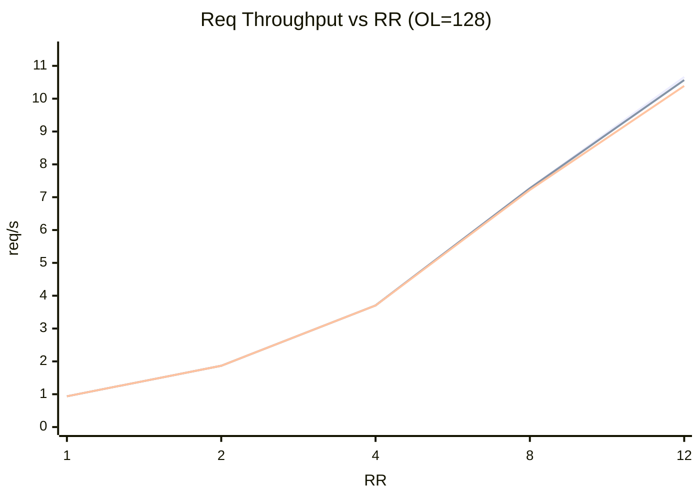
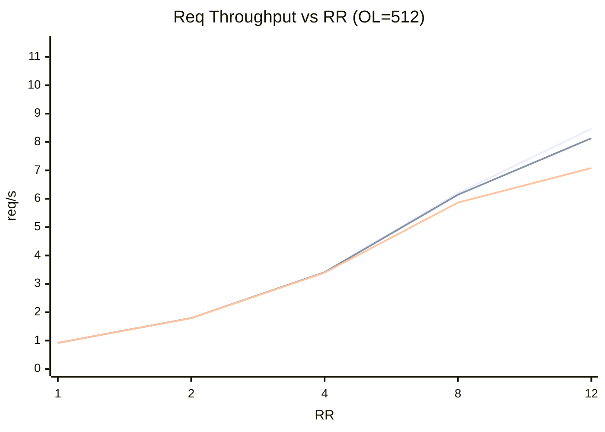
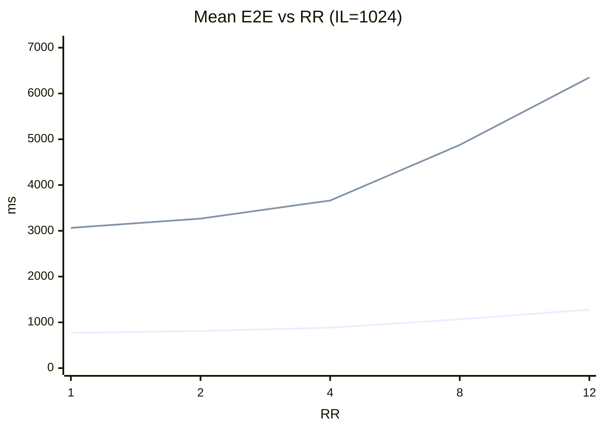
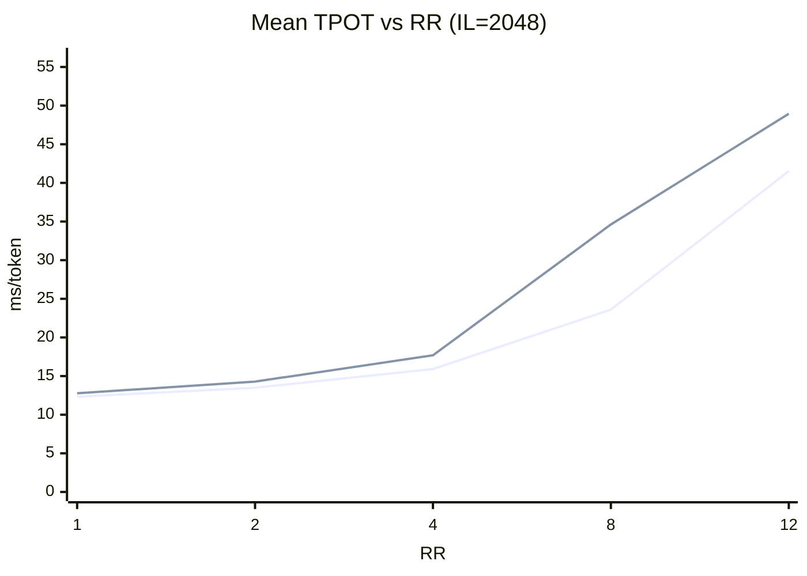
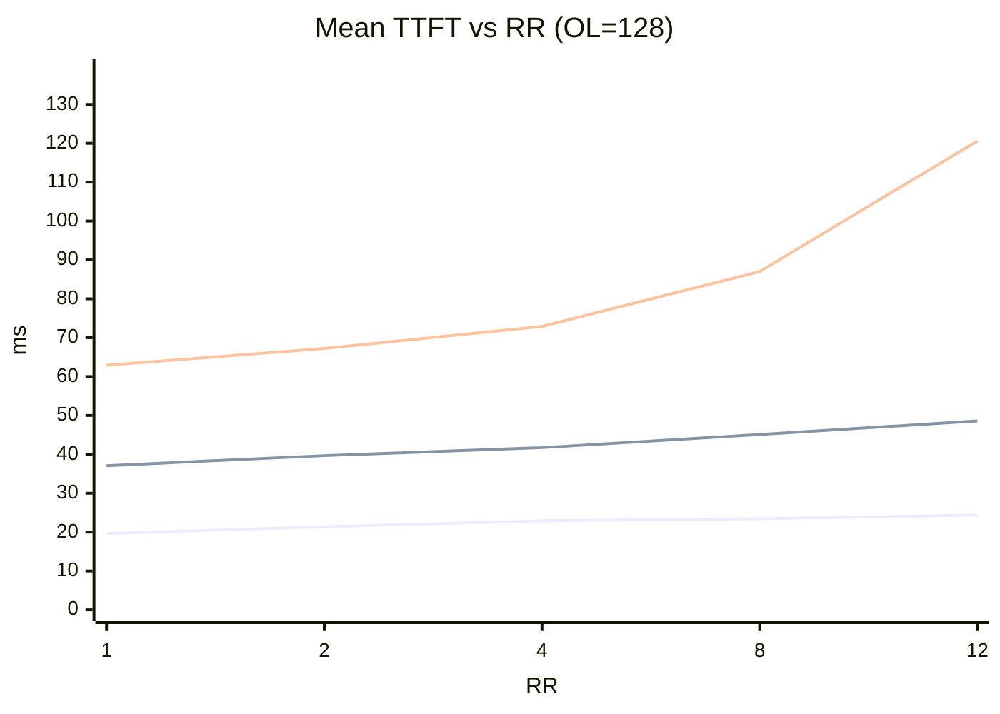
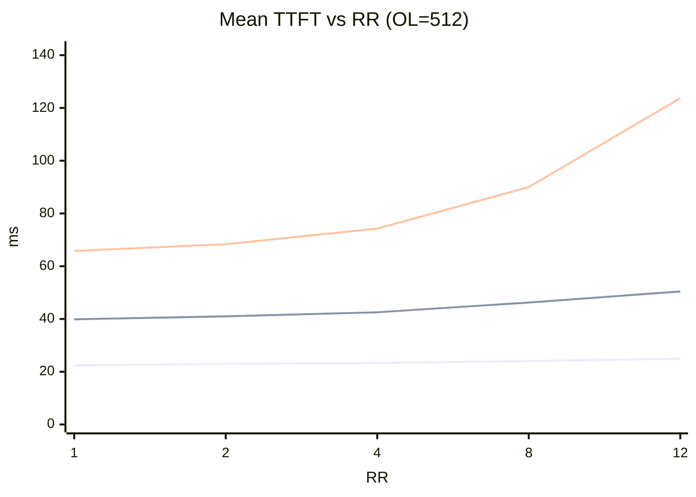
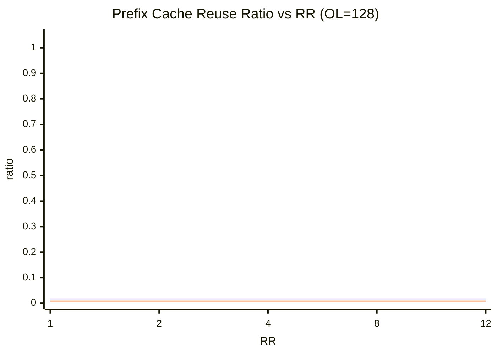

# HiSim PD Sweep Reasonableness Review

## Scope
- Data source: 30 run folders under /mnt/nfs02/users/yaoyao1/projects/hisim/cases_same_seed_flush_cache (5 rr x 3 il x 2 ol).
- Objective: check whether trends look reasonable, and identify suspicious results.

## How These Results Relate To PD Disaggregated Mode
- In PD disaggregated mode, prefill and decode are modeled as separate stages with potentially different bottlenecks.
- For this run, topology is effectively 1 prefill replica + 1 decode replica, so behavior resembles a serial two-stage pipeline.
- Expected trends:
  - Increasing input length should mostly raise TTFT.
  - Increasing output length should mostly raise TPOT and E2E.
  - Increasing request rate should raise queueing and eventually flatten throughput.

## High-Level Verdict
- Primary trend checks pass, and flush-cache appears sufficient to avoid the severe reuse contamination seen in the old fixed-seed no-flush run.
- Prefix cache reuse range is [0.0068, 0.0166] with mean 0.0104.

## Reasonableness Checks
- Completed requests: all runs have completed=200 -> True.
- Monotonic violations for throughput-vs-rr: 0.
- Monotonic violations for TTFT-vs-il: 0.
- mean_queue_ms negative in 30/30 runs (tiny ~-5e-06 artifact).
- mean_kv_transfer_ms equals 0 in 30/30 runs.
- mean_decode_queue_ms equals 0 in 30/30 runs.
- prefix_cache_reused_ratio >= 0.99 in 0/30 runs.

## Diagram 1: Request Throughput vs Request Rate (OL=128)
- Legend (line order in chart):
  - Line 1: IL=256, OL=128
  - Line 2: IL=1024, OL=128
  - Line 3: IL=2048, OL=128

- Interpretation:
  - Throughput scales with RR for all lines, and ordering remains IL=256 > IL=1024 > IL=2048 across RR.

## Diagram 2: Request Throughput vs Request Rate (OL=512)
- Legend (line order in chart):
  - Line 1: IL=256, OL=512
  - Line 2: IL=1024, OL=512
  - Line 3: IL=2048, OL=512

- Interpretation:
  - Throughput is generally lower than OL=128 at medium/high RR, consistent with heavier decode work.

## Diagram 3: Mean E2E Latency vs Request Rate (IL=1024)
- Legend (line order in chart):
  - Line 1: OL=128, IL=1024
  - Line 2: OL=512, IL=1024

- Interpretation:
  - OL=512 remains far above OL=128 and both increase with RR.

## Diagram 4: Mean TPOT vs Request Rate (IL=2048)
- Legend (line order in chart):
  - Line 1: OL=128, IL=2048
  - Line 2: OL=512, IL=2048

- Interpretation:
  - TPOT rises with RR, with OL=512 increasingly worse at high RR.

## Diagram 5: Mean TTFT vs Request Rate (OL=128)
- Legend (line order in chart):
  - Line 1: IL=256, OL=128
  - Line 2: IL=1024, OL=128
  - Line 3: IL=2048, OL=128

- Interpretation:
  - TTFT increases with both IL and RR, consistent with prefill pressure.

## Diagram 6: Mean TTFT vs Request Rate (OL=512)
- Legend (line order in chart):
  - Line 1: IL=256, OL=512
  - Line 2: IL=1024, OL=512
  - Line 3: IL=2048, OL=512

- Interpretation:
  - Separation by IL is clearer as RR increases.

## Diagram 7: Prefix Cache Reuse Ratio vs Request Rate (OL=128)
- Legend (line order in chart):
  - Line 1: IL=256, OL=128
  - Line 2: IL=1024, OL=128
  - Line 3: IL=2048, OL=128

- Interpretation:
  - Reuse remains low in this sweep, supporting your observation that flush-cache alone is sufficient for this setup.

## Final Assessment
- Cache contamination is no longer a dominant risk in this sweep.
- Tiny negative mean_queue_ms persists as numerical noise.
- Many runs still show zero mean_kv_transfer_ms / mean_decode_queue_ms, so PD transfer/queue stress may still be underrepresented for this config.

## Recommendations
- Keep the current flush-cache methodology if your target is trend comparison under this setup.
- If you need stronger PD-transfer visibility, increase transfer stress (higher load or transfer settings) and rerun a subset.
