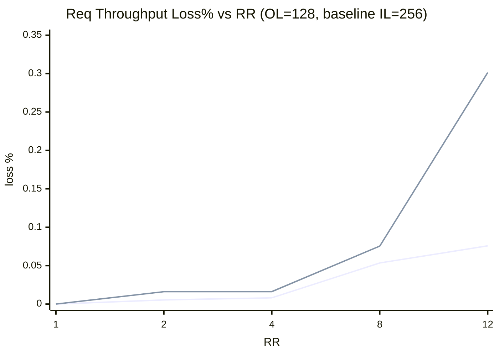
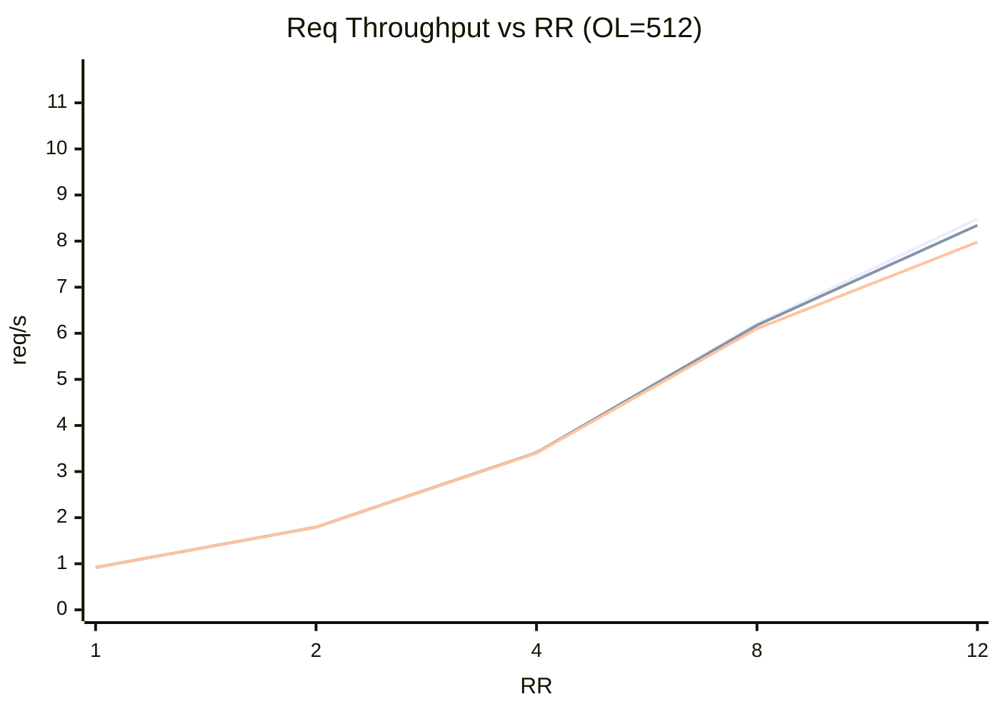
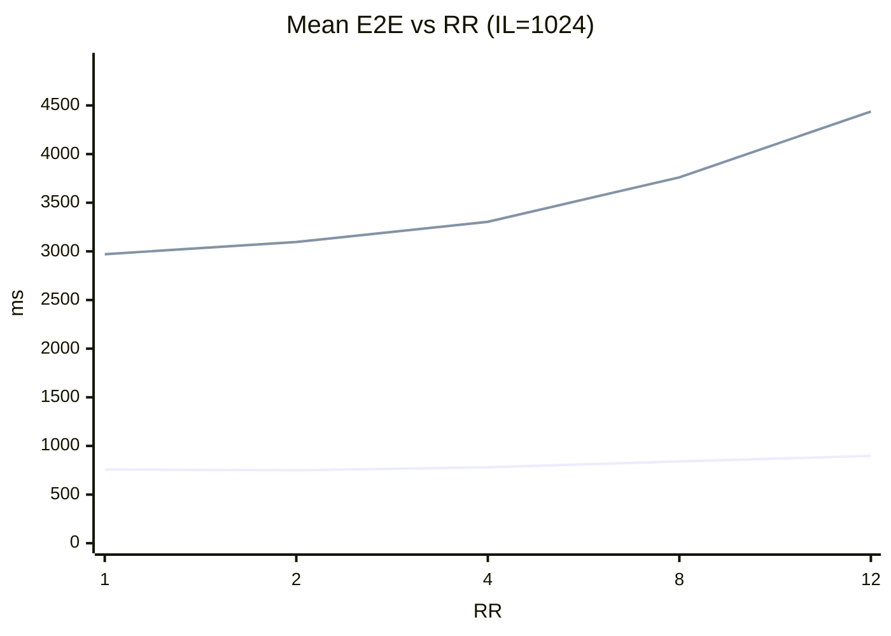
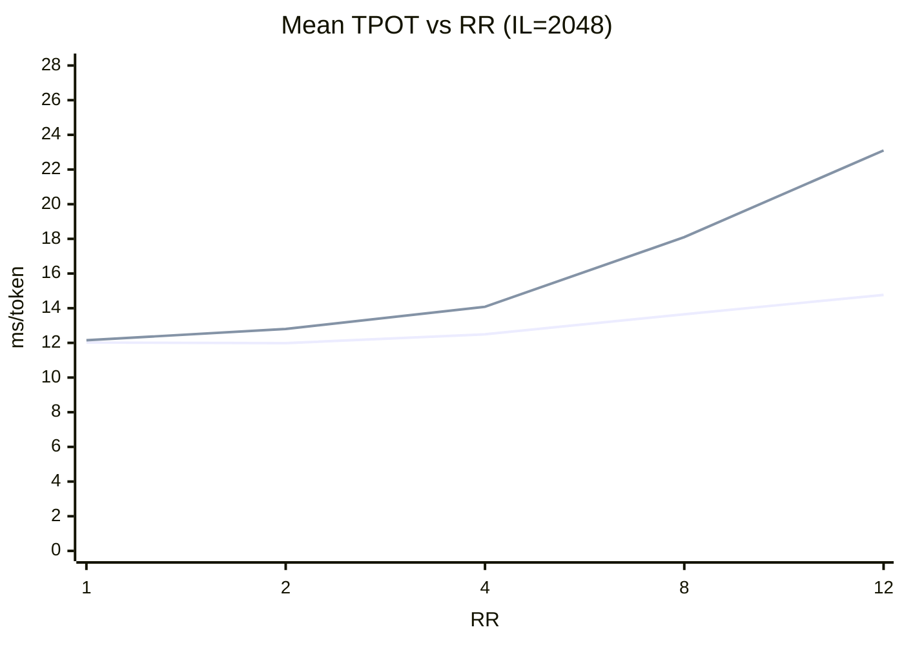
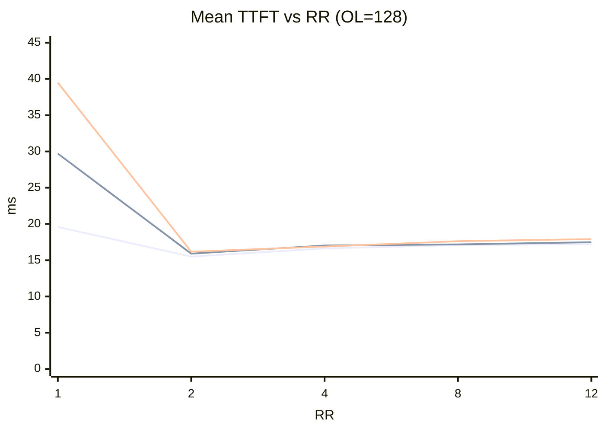
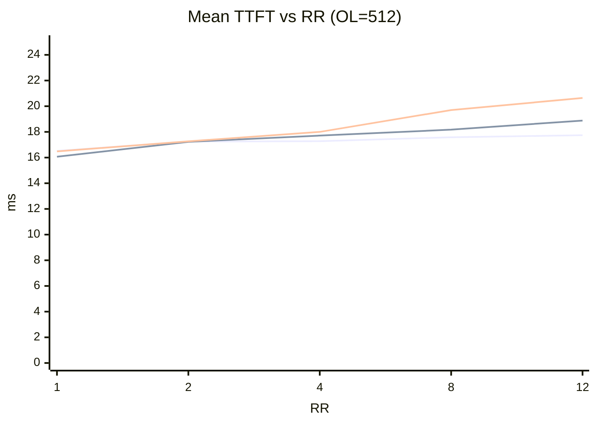
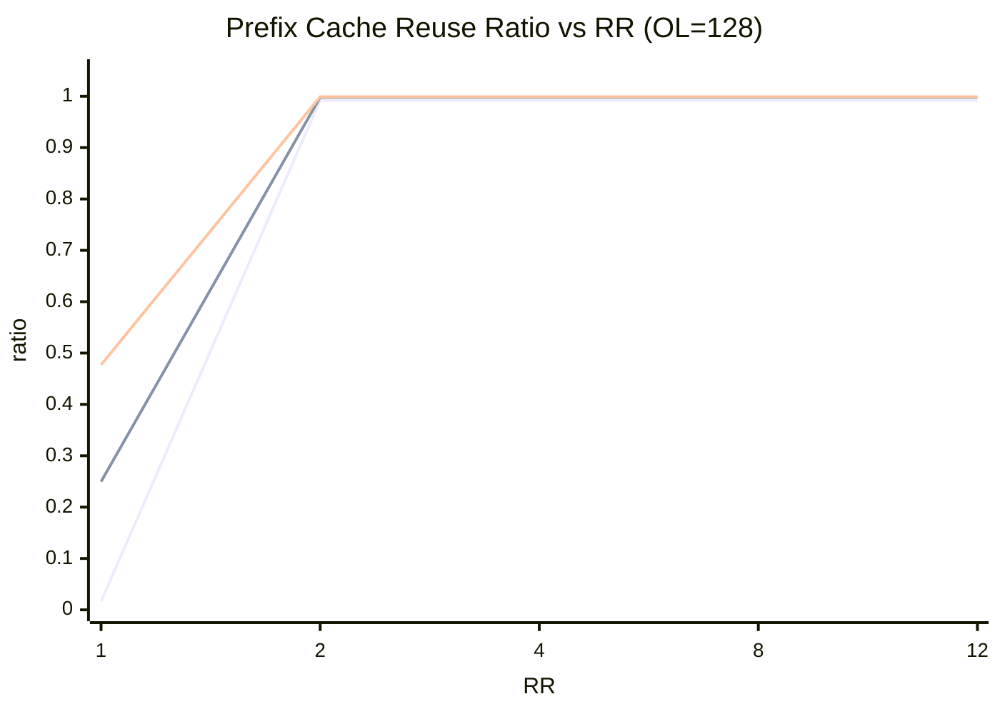

# HiSim PD Sweep Reasonableness Review

## Scope
- Data source: 30 run folders under this directory (5 rr x 3 il x 2 ol).
- Objective: check whether trends look reasonable, and identify suspicious results.

## How These Results Relate To PD Disaggregated Mode
- In PD disaggregated mode, prefill and decode are modeled as separate stages with potentially different bottlenecks.
- For this run, your topology is effectively 1 prefill replica + 1 decode replica, so system behavior should resemble a serial two-stage pipeline:
    - Stage A: prefill work (drives TTFT sensitivity to input length).
    - Stage B: decode work (drives TPOT and E2E sensitivity to output length and arrival rate).
    - Between stages: KV transfer (should contribute non-zero latency in a realistic PD stress scenario).
- Therefore, these PD trend expectations are reasonable:
    - Increasing input length should mostly push TTFT up (prefill side pressure).
    - Increasing output length should mostly push TPOT and E2E up (decode side pressure).
    - Increasing request rate should raise queueing and eventually cause throughput saturation.
- What weakens PD-specific interpretation in this dataset:
    - Prefix cache reuse is near 1.0 in most cases.
    - Stage metrics for KV transfer and decode queue are zero in most cases.
    - This makes the runs look more like warm-cache steady-state behavior than true PD stage-contention behavior.

## High-Level Verdict
- Primary trend checks pass: throughput grows with request rate, TTFT generally increases with input length, and E2E increases with output length.
- Major caveat: most runs have extremely high prefix cache reuse (>=0.99), which can make results look unrealistically good and reduce stage latencies to zero.
- Therefore: trend direction is mostly usable, but absolute and even some relative comparisons across settings are likely biased by cache contamination.

## Reasonableness Checks
- Completed requests: all runs have completed=200 -> True.
- Large monotonic violations for throughput-vs-rr: 0 (expected near 0).
- Large monotonic violations for TTFT-vs-il: 0 (expected near 0).
- mean_queue_ms negative in 30/30 runs (all around -5e-06, likely numeric artifact).
- mean_kv_transfer_ms equals 0 in 29/30 runs.
- mean_decode_queue_ms equals 0 in 29/30 runs.
- prefix_cache_reused_ratio >= 0.99 in 27/30 runs (strong warning).

## Diagram 1: Request Throughput vs Request Rate (OL=128)
- Legend:
    - Line 1: IL=256, OL=128
    - Line 2: IL=1024, OL=128
    - Line 3: IL=2048, OL=128
```mermaid
xychart-beta
    title "Req Throughput vs RR (OL=128)"
    x-axis "RR" [1, 2, 4, 8, 12]
    y-axis "req/s" 0 --> 11.7
    line [0.9369, 1.8666, 3.7037, 7.284, 10.6855]
    line [0.9369, 1.8665, 3.7034, 7.2801, 10.6774]
    line [0.9369, 1.8663, 3.7031, 7.2785, 10.6533]
```
- Expanded interpretation:
    - Note: these 3 lines are extremely close, so many renderers make them look like a single line.
    - All 3 lines increase monotonically with RR. This indicates the system is still in a scaling region for this arrival-rate range.
    - Line 1 is consistently highest, Line 3 is consistently lowest. That ordering matches PD intuition: longer inputs create more prefill pressure, reducing effective throughput.
    - The gap among lines is small, which is plausible for OL=128 because decode work is relatively short and prefill is not visibly queueing (consistent with near-zero stage queue metrics).
    - PD relevance: this plot mainly reflects prefill cost sensitivity under short outputs.

## Diagram 1b: Separation View for Diagram 1 (OL=128)
- Purpose: make the tiny differences visible by plotting percent throughput loss vs IL=256 baseline.
- Legend:
    - Line 1: IL=1024 loss% vs IL=256
    - Line 2: IL=2048 loss% vs IL=256

- Interpretation:
    - Both lines rise with RR, showing that longer inputs increasingly reduce throughput as load grows.
    - IL=2048 degrades faster than IL=1024, which is the expected PD prefill-side trend.

## Diagram 2: Request Throughput vs Request Rate (OL=512)
- Legend:
    - Line 1: IL=256, OL=512
    - Line 2: IL=1024, OL=512
    - Line 3: IL=2048, OL=512

- Expanded interpretation:
    - Throughput is lower than Diagram 1 at every RR/IL pair, which is expected because longer outputs increase decode-stage workload.
    - Degradation from IL=256 to IL=2048 is stronger at high RR (for example RR=12), suggesting combined pressure from prefill and decode as load rises.
    - No sharp saturation knee is observed yet, but slope flattening appears for higher RR.
    - PD relevance: this plot is more decode-influenced than Diagram 1 and better reflects end-to-end PD capacity when decode is substantial.

## Diagram 3: Mean E2E Latency vs Request Rate (IL=1024)
- Legend:
    - Line 1: OL=128, IL=1024
    - Line 2: OL=512, IL=1024

- Expanded interpretation:
    - Line 2 is far above Line 1, showing E2E is strongly driven by decode token count in PD mode.
    - Both lines trend upward with RR, which is consistent with increasing queueing and/or service-time contention.
    - The mild non-monotonic dip from RR=1 to RR=2 for OL=128 is small and within expected run-to-run noise.
    - PD relevance: this is the most direct user-visible signal of prefill+decode pipeline load; output length dominates total latency here.

## Diagram 4: Mean TPOT vs Request Rate (IL=2048)
- Legend:
    - Line 1: OL=128, IL=2048
    - Line 2: OL=512, IL=2048

- Expanded interpretation:
    - TPOT grows with RR for both lines, indicating decode stage slowdown under increased concurrent demand.
    - Line 2 (OL=512) diverges sharply at high RR, suggesting decode pressure and/or reduced decode efficiency at longer generation traces.
    - At low RR, Line 1 and Line 2 are close, which is expected when decode is not yet heavily queued.
    - PD relevance: TPOT is a decode-centric metric, so this chart is a key indicator for decode-side capacity limits in disaggregated serving.

## Diagram 5: Mean TTFT vs Request Rate (OL=128)
- Legend:
    - Line 1: IL=256, OL=128
    - Line 2: IL=1024, OL=128
    - Line 3: IL=2048, OL=128

- Expanded interpretation:
    - For RR >= 2, TTFT ordering is intuitive: larger IL tends to higher TTFT, matching prefill-stage cost in PD mode.
    - RR=1 shows a strong inversion (very high TTFT for larger IL), then TTFT drops sharply at RR=2. This is likely a warmup/cache-state artifact rather than a true queueing effect.
    - PD relevance: TTFT is mainly prefill-sensitive, so this figure is your direct view into prefill-side behavior, but the RR=1 point should be treated as outlier-ish baseline behavior.

## Diagram 6: Mean TTFT vs Request Rate (OL=512)
- Legend:
    - Line 1: IL=256, OL=512
    - Line 2: IL=1024, OL=512
    - Line 3: IL=2048, OL=512

- Expanded interpretation:
    - TTFT increases steadily with RR for all lines, and IL=2048 stays highest at moderate/high RR, which aligns with PD prefill expectations.
    - Separation between lines is clearer at higher RR, suggesting prefill pressure becomes more visible as system load increases.
    - PD relevance: compared with OL=128 chart, this one is cleaner and more monotonic; it is more trustworthy for trend reading.

## Diagram 7: Prefix Cache Reuse Ratio vs Request Rate (OL=128)
- Legend:
    - Line 1: IL=256, OL=128
    - Line 2: IL=1024, OL=128
    - Line 3: IL=2048, OL=128

- Expanded interpretation:
    - Reuse ratio jumps from low/moderate at RR=1 to near-1.0 for RR>=2 in almost all lines.
    - This indicates most tokens are served from cached prefixes in later runs, reducing true PD transfer/queue stress.
    - Consequence for PD interpretation:
        - KV transfer and decode queue metrics collapse toward zero.
        - Throughput and latency curves appear cleaner than expected for cold or independent requests.
        - Relative comparisons across rr/il/ol become less representative of real deployment behavior.
    - This is the strongest sign that your current sweep is valid for warm-cache trend observation, but not for strict PD bottleneck characterization.

## Final Assessment: What Seems Unreasonable
- Unreasonable: near-universal high cache reuse for a parameter sweep intended to compare workload trends. This likely contaminates fairness across cases.
- Unreasonable symptom: mean_kv_transfer_ms and mean_decode_queue_ms are 0 in 29/30 runs; this is unlikely for a true PD stress sweep.
- Probably harmless artifact: mean_queue_ms = -5e-06 in all runs (tiny negative float noise).

## Recommendations Before Trusting These Trends
- Run each case with cache isolation: add --flush-cache to bench command, or restart server per case.
- Vary seed per case to avoid identical prompt reuse; current fixed seed drives repeated prefixes.
- Keep request order randomized and ensure output folders are isolated per run (already done).
- Re-run a small subset (for example rr=1,4,12 at il=1024 and both ol) and verify reuse ratio drops to near 0 for fair comparisons.
