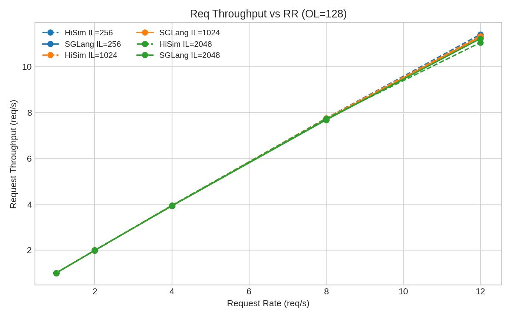
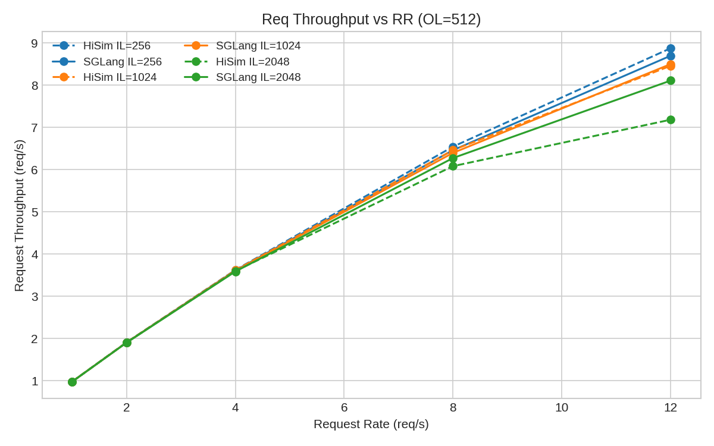
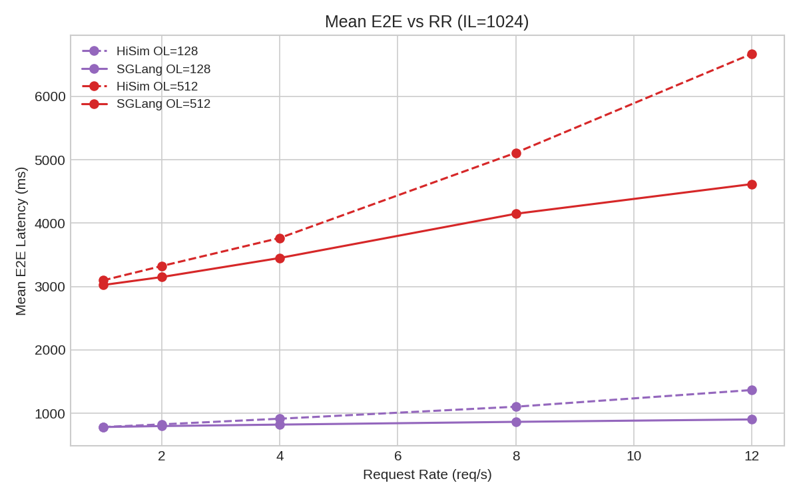
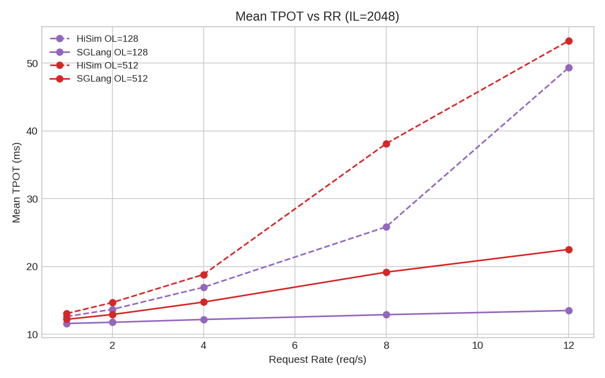
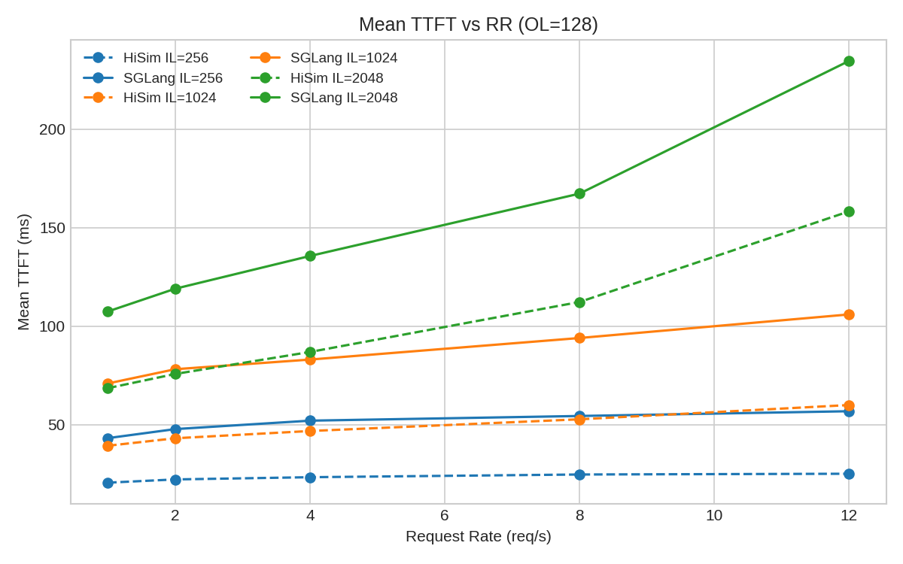
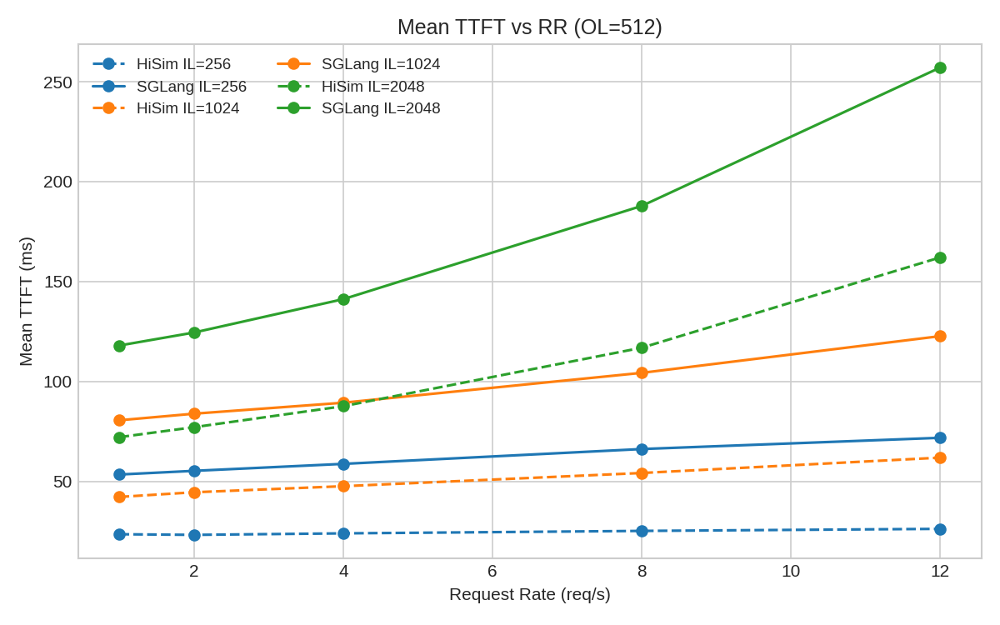
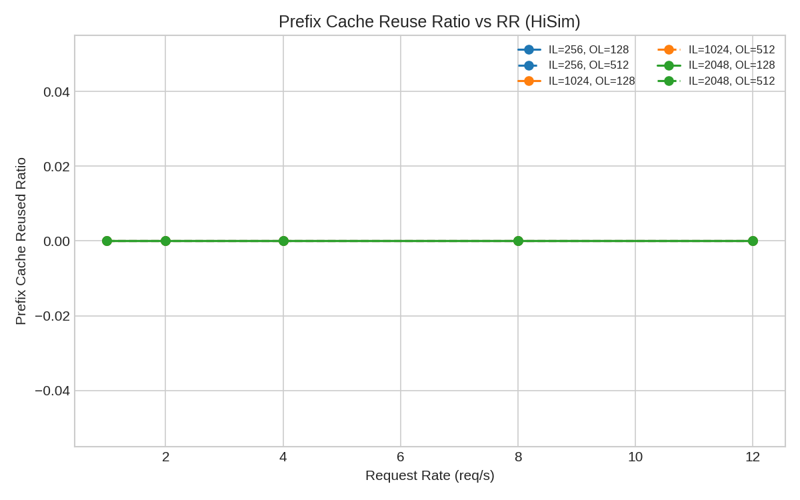

# HiSim vs SGLang 对比报告（PD NUMA Same-CPU 参数对齐）

## 1. 数据来源与对比范围
- **HiSim（全量新数据）**：`/mnt/nfs02/users/tjiang/Gitrepo/sglang/Hisim_SGLang_Data_20260612_numa_same_cpu/hisim_full_same_params_20260612/full/summary_metrics_hisim_sglang.csv`
- **SGLang（实测 NUMA0）**：`/mnt/nfs02/users/tjiang/Gitrepo/sglang/Hisim_SGLang_Data_20260612_numa_same_cpu/full/summary_metrics_numa0.csv`
- **Case 空间一致**：`rr={1,2,4,8,12} × il={256,1024,2048} × ol={128,512}`，共 30 组
- **重叠组数**：30/30
- **每组 completed**：HiSim=200，SGLang=200（全部一致）

## 2. 核心结论
- 本轮 30 组全重叠后，**吞吐均值接近**：HiSim `4.6966 req/s`，SGLang `4.7161 req/s`。
- **TTFT**：SGLang 明显更高（均值 `102.15ms` vs `58.25ms`）。
- **TPOT**：SGLang 更低（均值 `13.45ms` vs `18.65ms`）。
- **E2E**：SGLang 整体更低（均值 `2301.05ms` vs `2968.29ms`）。

## 3. 图表对比（同图叠加）
图例规则：
- 虚线：HiSim
- 实线：SGLang
- 同色：同一参数组

### 图 1：Req Throughput vs RR（OL=128）

### 图 2：Req Throughput vs RR（OL=512）

### 图 3：Mean E2E vs RR（IL=1024）

### 图 4：Mean TPOT vs RR（IL=2048）

### 图 5：Mean TTFT vs RR（OL=128）

### 图 6：Mean TTFT vs RR（OL=512）

### 图 7：Prefix Cache Reuse Ratio vs RR（HiSim）

## 4. RR=12 截面关键对比
| OL | IL | Req/s HiSim | Req/s SGLang | TTFT HiSim(ms) | TTFT SGLang(ms) | TPOT HiSim(ms) | TPOT SGLang(ms) | E2E HiSim(ms) | E2E SGLang(ms) |
| ---: | ---: | ---: | ---: | ---: | ---: | ---: | ---: | ---: | ---: |
| 128 | 256 | 11.4065 | 11.3022 | 25.12 | 56.84 | 15.34 | 12.35 | 969.32 | 821.55 |
| 128 | 1024 | 11.3371 | 11.2840 | 59.98 | 105.94 | 21.62 | 12.87 | 1367.64 | 903.74 |
| 128 | 2048 | 11.0504 | 11.2223 | 158.21 | 234.53 | 49.31 | 13.50 | 3062.34 | 1074.38 |
| 512 | 256 | 8.8743 | 8.6962 | 26.18 | 71.77 | 17.50 | 16.01 | 4305.23 | 4015.79 |
| 512 | 1024 | 8.4572 | 8.4984 | 61.84 | 122.65 | 27.35 | 18.25 | 6671.08 | 4616.77 |
| 512 | 2048 | 7.1817 | 8.1077 | 162.07 | 257.11 | 53.29 | 22.51 | 11850.95 | 5801.73 |

### RR=12 百分比差异（SGLang - HiSim）
| OL | IL | Req Δ% | TTFT Δ% | TPOT Δ% | E2E Δ% |
| ---: | ---: | ---: | ---: | ---: | ---: |
| 128 | 256 | -0.9% | +126.2% | -19.5% | -15.2% |
| 128 | 1024 | -0.5% | +76.6% | -40.5% | -33.9% |
| 128 | 2048 | +1.6% | +48.2% | -72.6% | -64.9% |
| 512 | 256 | -2.0% | +174.1% | -8.5% | -6.7% |
| 512 | 1024 | +0.5% | +98.3% | -33.3% | -30.8% |
| 512 | 2048 | +12.9% | +58.6% | -57.8% | -51.0% |

## 5. 补充观察
- 本轮 HiSim `prefix_cache_reused_ratio` 为 0（`min=max=mean=0`），图 7 为全零平线。
- 这也是之前“只有一个重叠”的直接修复结果：现在已扩展为与 SGLang 同参数全流程 30 组对齐。

## 6. 产物文件
- 对比汇总表：`/mnt/nfs02/users/tjiang/Gitrepo/sglang/Hisim_SGLang_Data_20260612_numa_same_cpu/hisim_sglang_full_compare_20260612/summary_compare.csv`
- 对比图目录：`/mnt/nfs02/users/tjiang/Gitrepo/sglang/Hisim_SGLang_Data_20260612_numa_same_cpu/hisim_sglang_full_compare_20260612/plots/`
