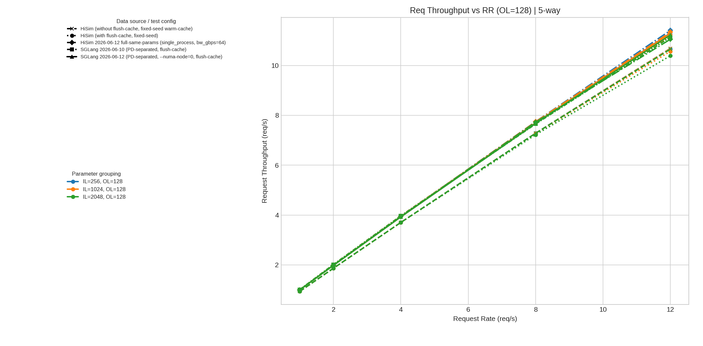
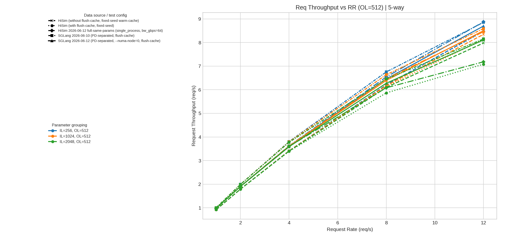
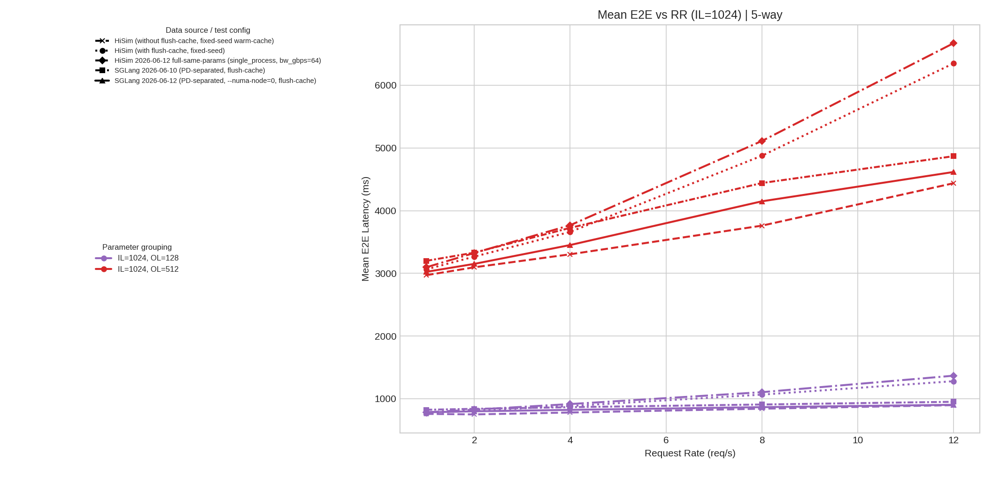
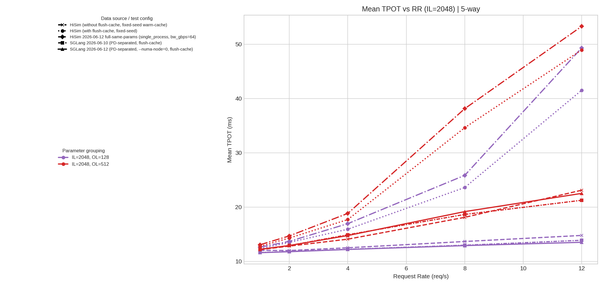
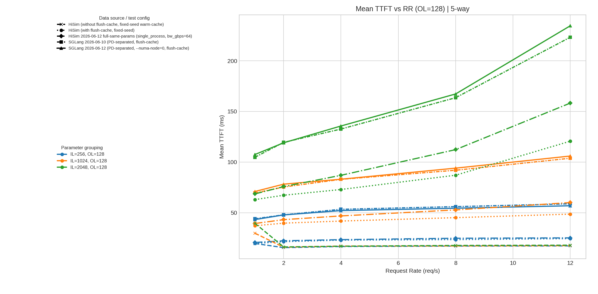
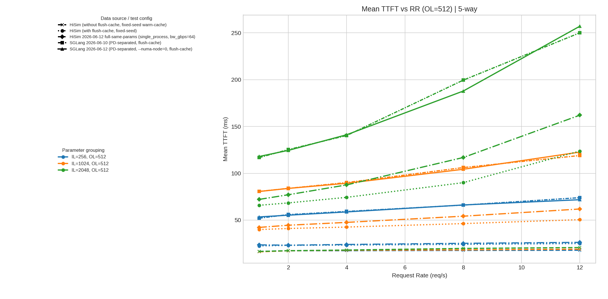
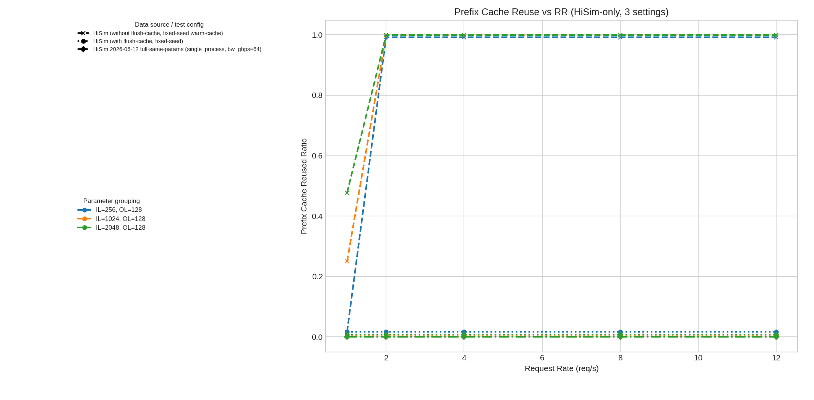

# HiSim / SGLang 五组对比说明（加入 HiSim without flush-cache + HiSim 0612 full same params）

## 1. 数据来源
- **HiSim（without flush-cache，固定 seed，warm-cache）**  
  `/mnt/nfs02/users/tjiang/Gitrepo/sglang/Hisim_Data_without_flush_cache/summary_metrics.csv`
- **HiSim（with flush-cache，固定 seed）**  
  `/mnt/nfs02/users/tjiang/Gitrepo/sglang/Hisim_Data_using_flush_cache/cases_same_seed_flush_cache/summary_metrics.csv`
- **HiSim（2026-06-12 full same params，single_process，bw_gbps=64）**  
  `/mnt/nfs02/users/tjiang/Gitrepo/sglang/Hisim_SGLang_Data_20260612_numa_same_cpu/hisim_full_same_params_20260612/full/summary_metrics_hisim_sglang.csv`
- **SGLang（2026-06-10，PD-separated，flush-cache）**  
  `/mnt/nfs02/users/tjiang/Gitrepo/sglang/SGLang_Data_20260610_flush_cache/summary_metrics_flush_cache.csv`
- **SGLang（2026-06-12，PD-separated，--numa-node=0，flush-cache）**  
  `/mnt/nfs02/users/tjiang/Gitrepo/sglang/Hisim_SGLang_Data_20260612_numa_same_cpu/full/summary_metrics_numa0.csv`

五组按 `rr, il, ol` 对齐，重叠 **30/30** 个 case。

## 2. 产物文件
- 五组汇总表：`summary_compare_fiveway.csv`
- 总览图目录：`plots/`
- 每个 case 单图目录：`case_plots/`（共 30 张）

## 3. 图例（按实际测试内容）
总览图里图例分两层：
- **Data source / test config（线型+marker）**
  - `HiSim (without flush-cache, fixed-seed warm-cache)`
  - `HiSim (with flush-cache, fixed-seed)`
  - `HiSim 2026-06-12 full-same-params (single_process, bw_gbps=64)`
  - `SGLang 2026-06-10 (PD-separated, flush-cache)`
  - `SGLang 2026-06-12 (PD-separated, --numa-node=0, flush-cache)`
- **Parameter grouping（颜色）**
  - 吞吐/TTFT 图：颜色区分 `IL`
  - E2E/TPOT 图：颜色区分 `OL`

> 说明：图文件名沿用历史命名 `*_threeway.png`，但内容已是五组对比。

## 4. 总览图说明（plots）
- `fig1_throughput_ol128_threeway.png`：OL=128 时吞吐 vs RR（五组）
- `fig2_throughput_ol512_threeway.png`：OL=512 时吞吐 vs RR（五组）
- `fig3_e2e_il1024_threeway.png`：IL=1024 时 E2E vs RR（五组）
- `fig4_tpot_il2048_threeway.png`：IL=2048 时 TPOT vs RR（五组）
- `fig5_ttft_ol128_threeway.png`：OL=128 时 TTFT vs RR（五组）
- `fig6_ttft_ol512_threeway.png`：OL=512 时 TTFT vs RR（五组）
- `fig7_prefix_reuse_hisim_yesterday.png`：HiSim 三种设置（noflush/flush/0612full）prefix reuse 对比

### 图 1：Req Throughput vs RR（OL=128）

### 图 2：Req Throughput vs RR（OL=512）

### 图 3：Mean E2E vs RR（IL=1024）

### 图 4：Mean TPOT vs RR（IL=2048）

### 图 5：Mean TTFT vs RR（OL=128）

### 图 6：Mean TTFT vs RR（OL=512）

### 图 7：Prefix Cache Reuse（HiSim with/without flush-cache）

## 5. 单 case 图说明（case_plots）
命名格式：`case_rr{RR}_il{IL}_ol{OL}_threeway.png`  
每张图包含 4 个子图（Req/s、TTFT、TPOT、E2E），并展示五组数据：
- HiSim (without flush-cache, fixed-seed warm-cache)
- HiSim (with flush-cache, fixed-seed)
- HiSim 2026-06-12 full-same-params (single_process, bw_gbps=64)
- SGLang 2026-06-10 (PD-separated, flush-cache)
- SGLang 2026-06-12 (PD-separated, --numa-node=0, flush-cache)
