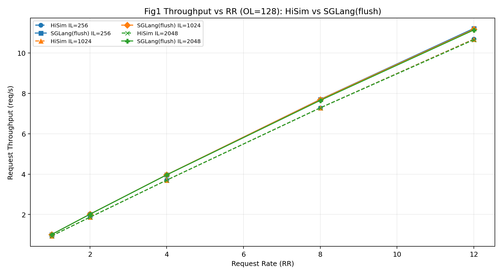
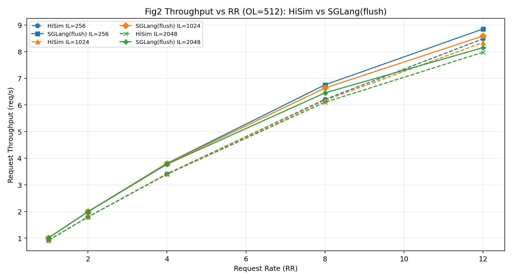
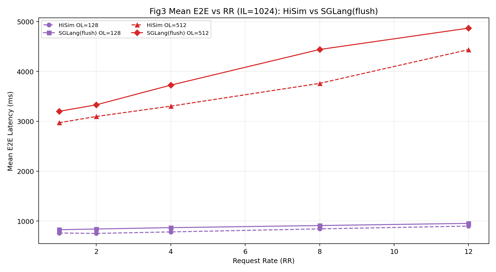
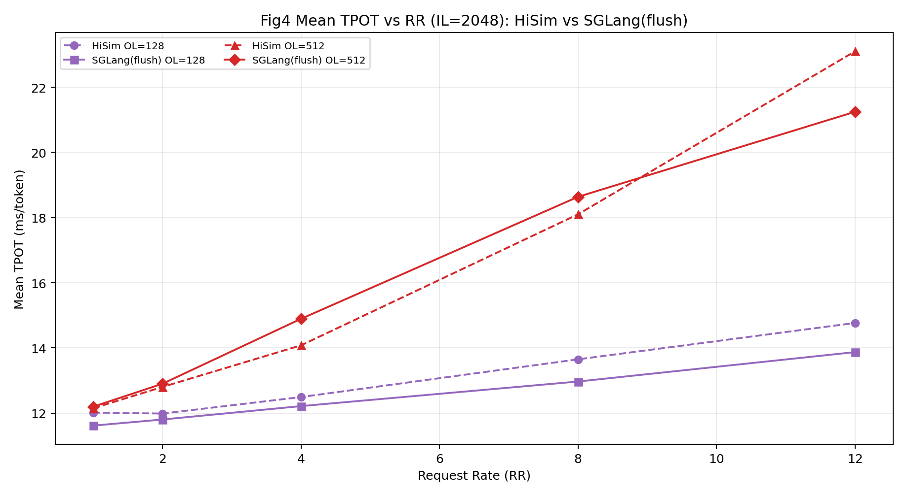
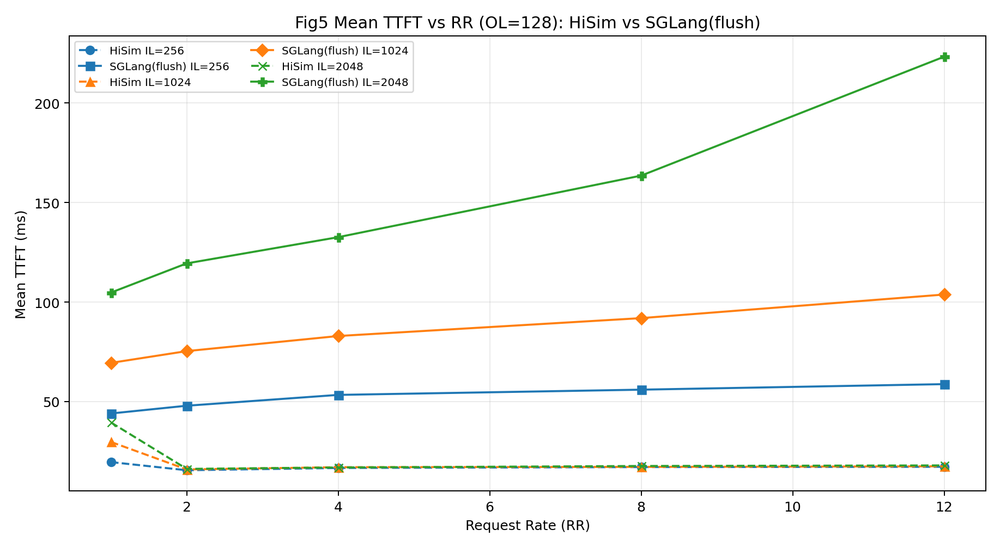
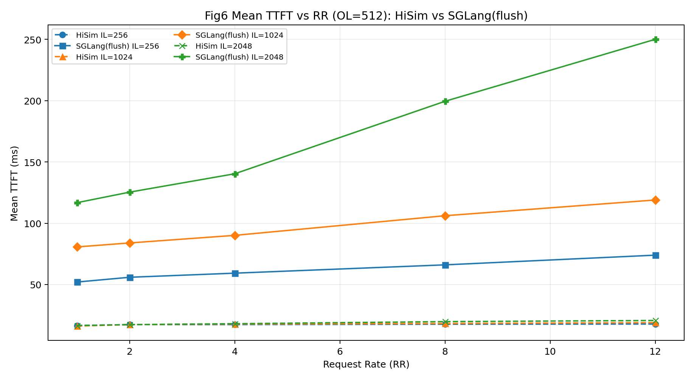
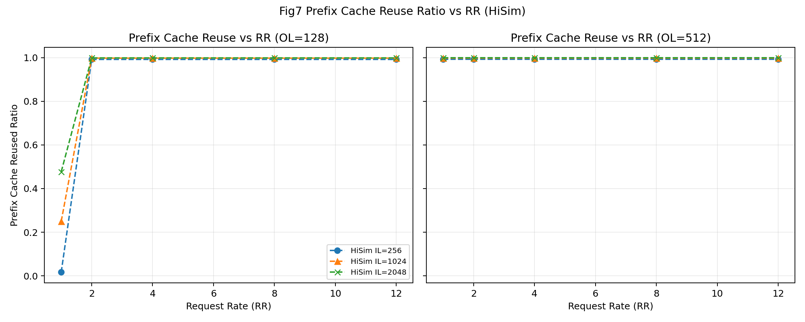

# 真实 SGLang 运行情况汇报（`--flush-cache` 重跑版）

## 1. 结论摘要
- 你提到的点是正确的：之前一轮未加 `--flush-cache`。本次已按相同 30 组 case **全量重跑**，每组都显式使用了 `--flush-cache`。
- 重跑后，趋势仍与 HiSim 一致（吞吐随 RR 上升、OL=512 时 decode 压力更高），但 **TTFT 显著抬升**，说明前一版结果确实受缓存复用影响。
- 本报告及对比图均基于这轮 flush 数据。

## 2. 本轮实验口径（已执行）
- Case 组合：`rr={1,2,4,8,12} × il={256,1024,2048} × ol={128,512}`（共 30 组）
- 每组请求：`200`
- 数据集：`random`
- 服务：SGLang PD（router: `127.0.0.1:30002`）
- 关键参数：`--flush-cache`
- 输出目录：`SGLang_Data_20260610_flush_cache/`

## 3. 数据完整性检查
- 结果文件数：`30`
- `completed`：全部为 `200`
- 缺失 case：`0`
- 单调性检查：
  - throughput vs RR 违规数：`0`
  - TTFT vs IL 违规数：`0`

## 4. 同图叠加对比（HiSim vs SGLang flush）

图例规则：
- **虚线**：HiSim
- **实线**：SGLang（flush）
- **同色**：同一参数组（IL 或 OL）

### 图 1：Req Throughput vs RR（OL=128）

### 图 2：Req Throughput vs RR（OL=512）

### 图 3：Mean E2E vs RR（IL=1024）

### 图 4：Mean TPOT vs RR（IL=2048）

### 图 5：Mean TTFT vs RR（OL=128）

### 图 6：Mean TTFT vs RR（OL=512）

### 图 7：Prefix Cache Reuse Ratio vs RR（HiSim）

> 说明：SGLang bench 当前输出不含 `prefix_cache_reused_ratio` 字段，因此图 7 仅能展示 HiSim 的 RR 对比。若要加入 SGLang 对比线，需要服务侧开启 cache report 并重跑。

## 5. RR=12 关键对比（HiSim vs SGLang flush）
| OL | IL | Req/s HiSim | Req/s SGLang(flush) | TTFT HiSim(ms) | TTFT SGLang(ms) | TPOT HiSim(ms) | TPOT SGLang(ms) | E2E HiSim(ms) | E2E SGLang(ms) |
| ---: | ---: | ---: | ---: | ---: | ---: | ---: | ---: | ---: | ---: |
| 128 | 256 | 10.6855 | 11.2124 | 17.21 | 58.76 | 13.91 | 12.51 | 879.30 | 874.89 |
| 128 | 1024 | 10.6774 | 11.1704 | 17.48 | 103.77 | 14.20 | 12.96 | 897.34 | 951.60 |
| 128 | 2048 | 10.6533 | 11.1354 | 17.92 | 223.25 | 14.77 | 13.87 | 932.58 | 1124.43 |
| 512 | 256 | 8.4830 | 8.8510 | 17.74 | 73.94 | 15.93 | 16.12 | 3939.81 | 4297.98 |
| 512 | 1024 | 8.3442 | 8.5887 | 18.88 | 118.97 | 17.97 | 18.09 | 4437.54 | 4868.71 |
| 512 | 2048 | 7.9775 | 8.1505 | 20.64 | 250.07 | 23.10 | 21.25 | 5684.70 | 5819.43 |

## 6. 交付数据
- 本轮全量结果：`/mnt/nfs02/users/tjiang/Gitrepo/sglang/SGLang_Data_20260610_flush_cache/*.jsonl`
- 本轮汇总表：`/mnt/nfs02/users/tjiang/Gitrepo/sglang/SGLang_Data_20260610_flush_cache/summary_metrics_flush_cache.csv`
- 本轮对比图：`/mnt/nfs02/users/tjiang/Gitrepo/sglang/SGLang_Data_20260610_flush_cache/compare_plots_flush_cache/*.png`
