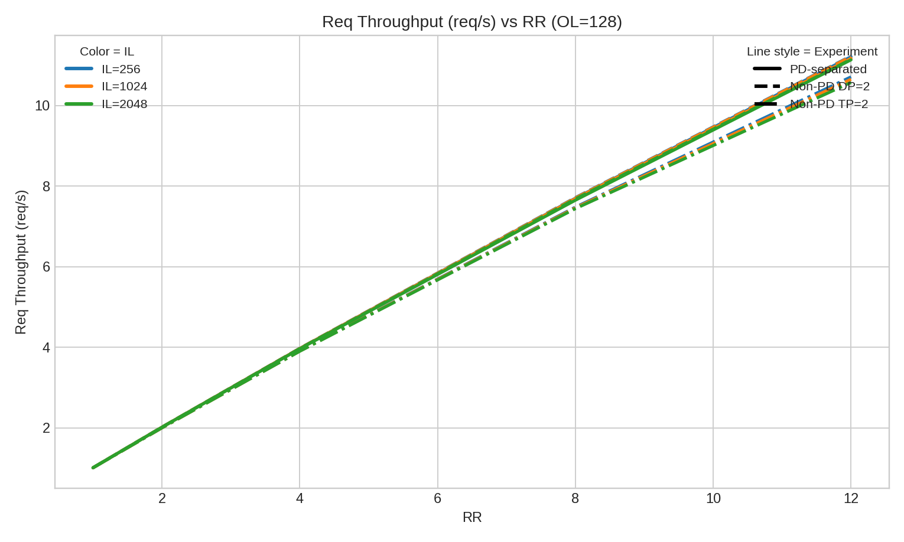
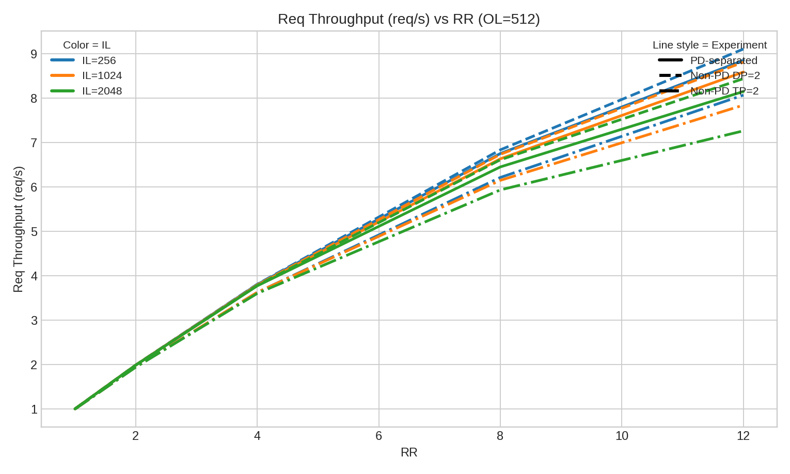
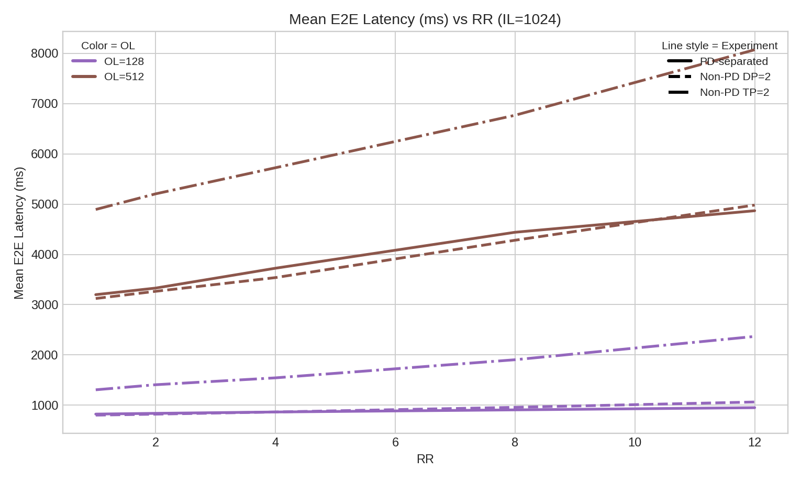
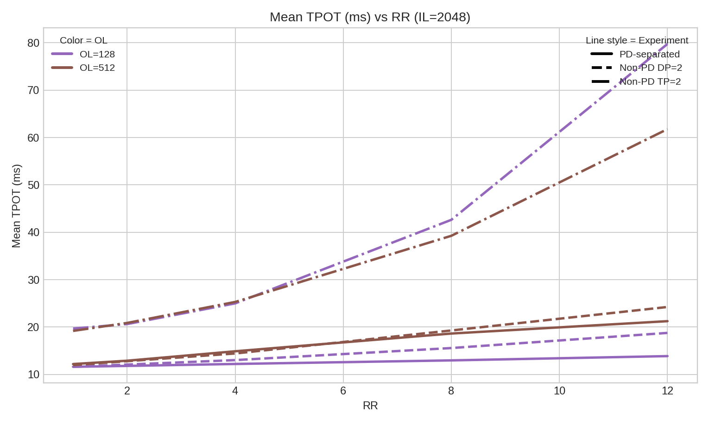
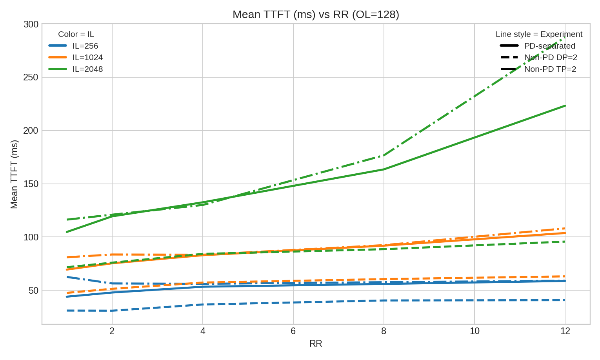
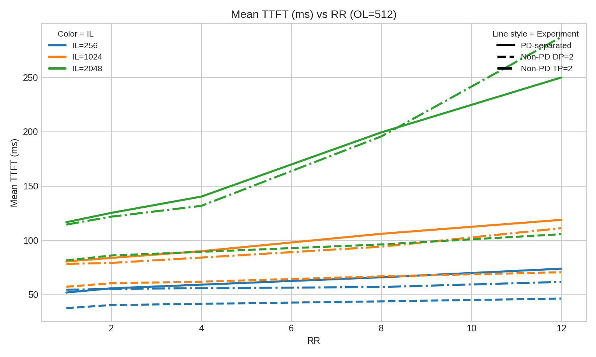

# SGLang 非 PD（DP=2/TP=2）与 PD 分离对比报告（2026-06-11）

## 1. 数据来源与对比范围
- **PD 分离（已有实测）**：`/mnt/nfs02/users/tjiang/Gitrepo/sglang/SGLang_Data_20260610_flush_cache/summary_metrics_flush_cache.csv`
- **非 PD - DP=2（本轮实测）**：`/mnt/nfs02/users/tjiang/Gitrepo/sglang/SGLang_Data_20260611_using)_flush_cache/non_pd_dp2_sweep_20260611`
- **非 PD - TP=2（本轮实测）**：`/mnt/nfs02/users/tjiang/Gitrepo/sglang/SGLang_Data_20260611_using)_flush_cache/non_pd_tp2_sweep_20260611`
- **Case 空间一致**：`rr={1,2,4,8,12} × il={256,1024,2048} × ol={128,512}`，共 30 组
- **每组 completed**：三组均为 200

> 说明：TP=2 在本机默认参数下会出现请求卡死；为保证 TP=2 可稳定跑完，本轮 TP=2 服务端使用了 `--disable-cuda-graph --disable-custom-all-reduce`。

## 2. 核心结论
- 相比 PD 分离，**非 PD 的 DP=2** 在本轮 30 组平均表现为：
  - Req Throughput：`1.006x`
  - Mean TTFT：`0.647x`
  - Mean TPOT：`1.031x`
  - Mean E2E：`1.001x`
- 相比 PD 分离，**非 PD 的 TP=2** 在本轮 30 组平均表现为：
  - Req Throughput：`0.966x`
  - Mean TTFT：`1.029x`
  - Mean TPOT：`1.964x`
  - Mean E2E：`1.802x`

## 3. 图表对比（三组叠加）

图例规则：
- 颜色：图 1/2/5/6 用 `IL` 区分；图 3/4 用 `OL` 区分
- 线型（固定映射）：`实线 = PD-separated`，`虚线 = Non-PD DP=2`，`点划线 = Non-PD TP=2`

### 图 1：Req Throughput vs RR（OL=128）

### 图 2：Req Throughput vs RR（OL=512）

### 图 3：Mean E2E vs RR（IL=1024）

### 图 4：Mean TPOT vs RR（IL=2048）

### 图 5：Mean TTFT vs RR（OL=128）

### 图 6：Mean TTFT vs RR（OL=512）

## 4. RR=12 截面关键对比
|   OL |   IL |   Req/s PD |   Req/s NonPD-DP2 |   Req/s NonPD-TP2 |   TTFT PD(ms) |   TTFT NonPD-DP2(ms) |   TTFT NonPD-TP2(ms) |   TPOT PD(ms) |   TPOT NonPD-DP2(ms) |   TPOT NonPD-TP2(ms) |   E2E PD(ms) |   E2E NonPD-DP2(ms) |   E2E NonPD-TP2(ms) |
|-----:|-----:|-----------:|------------------:|------------------:|--------------:|---------------------:|---------------------:|--------------:|---------------------:|---------------------:|-------------:|--------------------:|--------------------:|
|  128 |  256 |    11.2124 |           11.2293 |           10.7117 |         58.76 |                40.73 |                59    |         12.51 |                13.21 |                24.71 |       874.89 |              909.81 |             1670.56 |
|  128 | 1024 |    11.1704 |           11.2176 |           10.6524 |        103.77 |                63.09 |               108.13 |         12.96 |                15.35 |                35.05 |       951.6  |             1064.54 |             2368.48 |
|  128 | 2048 |    11.1354 |           11.1477 |           10.5751 |        223.25 |                95.72 |               287.56 |         13.87 |                18.77 |                79.75 |      1124.43 |             1323.97 |             4444.13 |
|  512 |  256 |     8.851  |            9.1067 |            8.0696 |         73.94 |                46.42 |                61.78 |         16.12 |                15.65 |                23.97 |      4297.98 |             4123.51 |             6144.71 |
|  512 | 1024 |     8.5887 |            8.8114 |            7.8435 |        118.97 |                70.7  |               111.3  |         18.09 |                18.94 |                31.9  |      4868.71 |             4981.08 |             8070.43 |
|  512 | 2048 |     8.1505 |            8.4393 |            7.2651 |        250.07 |               105.73 |               287.39 |         21.25 |                24.24 |                61.78 |      5819.43 |             6342.22 |            12205.1  |

### RR=12 相对 PD 的百分比差异
|   OL |   IL | 实验        | Req Δ% vs PD   | TTFT Δ% vs PD   | TPOT Δ% vs PD   | E2E Δ% vs PD   |
|-----:|-----:|:------------|:---------------|:----------------|:----------------|:---------------|
|  128 |  256 | Non-PD DP=2 | +0.2%          | -30.7%          | +5.6%           | +4.0%          |
|  128 |  256 | Non-PD TP=2 | -4.5%          | +0.4%           | +97.5%          | +90.9%         |
|  128 | 1024 | Non-PD DP=2 | +0.4%          | -39.2%          | +18.4%          | +11.9%         |
|  128 | 1024 | Non-PD TP=2 | -4.6%          | +4.2%           | +170.4%         | +148.9%        |
|  128 | 2048 | Non-PD DP=2 | +0.1%          | -57.1%          | +35.3%          | +17.7%         |
|  128 | 2048 | Non-PD TP=2 | -5.0%          | +28.8%          | +474.9%         | +295.2%        |
|  512 |  256 | Non-PD DP=2 | +2.9%          | -37.2%          | -3.0%           | -4.1%          |
|  512 |  256 | Non-PD TP=2 | -8.8%          | -16.4%          | +48.7%          | +43.0%         |
|  512 | 1024 | Non-PD DP=2 | +2.6%          | -40.6%          | +4.7%           | +2.3%          |
|  512 | 1024 | Non-PD TP=2 | -8.7%          | -6.4%           | +76.3%          | +65.8%         |
|  512 | 2048 | Non-PD DP=2 | +3.5%          | -57.7%          | +14.1%          | +9.0%          |
|  512 | 2048 | Non-PD TP=2 | -10.9%         | +14.9%          | +190.8%         | +109.7%        |

## 5. 产物文件
- 三组汇总表：`/mnt/nfs02/users/tjiang/Gitrepo/sglang/SGLang_Data_20260611_using)_flush_cache/non_pd_vs_pd_compare_20260611/summary_compare_threeway.csv`
- RR=12 对比表：`/mnt/nfs02/users/tjiang/Gitrepo/sglang/SGLang_Data_20260611_using)_flush_cache/non_pd_vs_pd_compare_20260611/rr12_threeway_table.csv`
- RR=12 相对差异：`/mnt/nfs02/users/tjiang/Gitrepo/sglang/SGLang_Data_20260611_using)_flush_cache/non_pd_vs_pd_compare_20260611/rr12_delta_vs_pd.csv`
- 图目录：`/mnt/nfs02/users/tjiang/Gitrepo/sglang/SGLang_Data_20260611_using)_flush_cache/non_pd_vs_pd_compare_20260611/plots`
- DP=2 汇总：`/mnt/nfs02/users/tjiang/Gitrepo/sglang/SGLang_Data_20260611_using)_flush_cache/non_pd_dp2_sweep_20260611/summary_metrics_nonpd_dp2.csv`
- TP=2 汇总：`/mnt/nfs02/users/tjiang/Gitrepo/sglang/SGLang_Data_20260611_using)_flush_cache/non_pd_tp2_sweep_20260611/summary_metrics_nonpd_tp2.csv`
