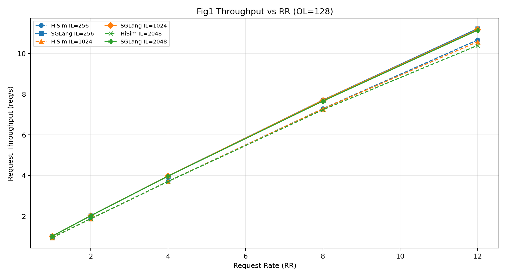
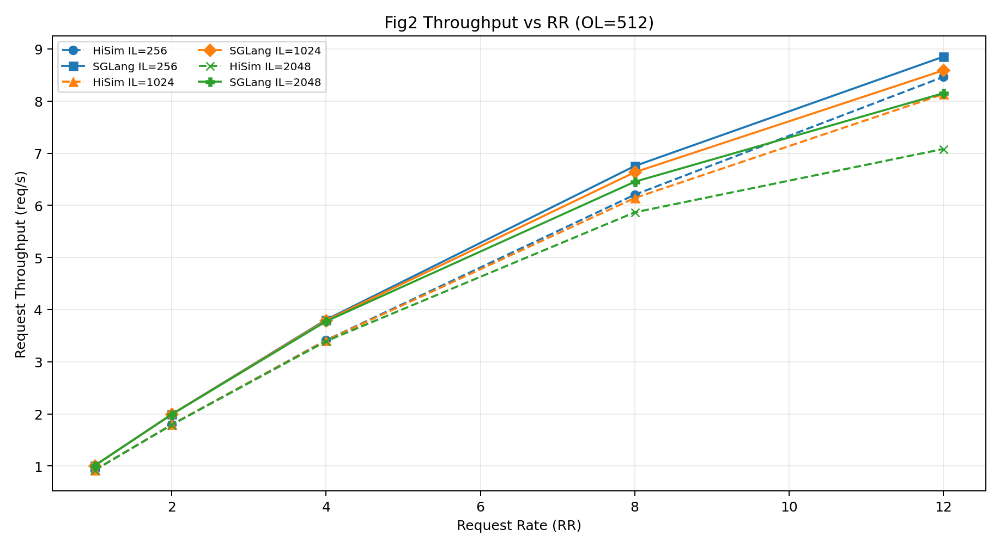
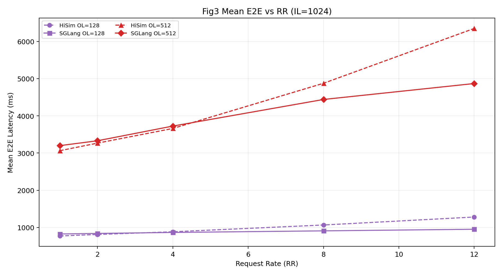
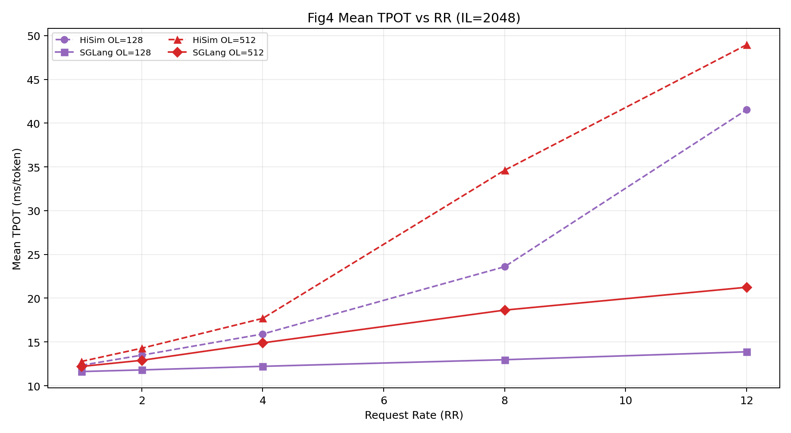
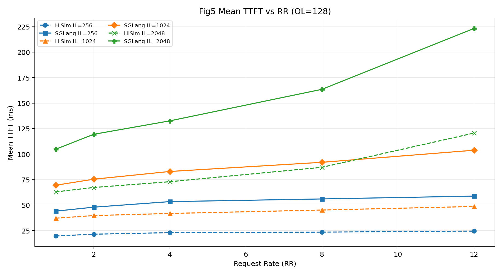
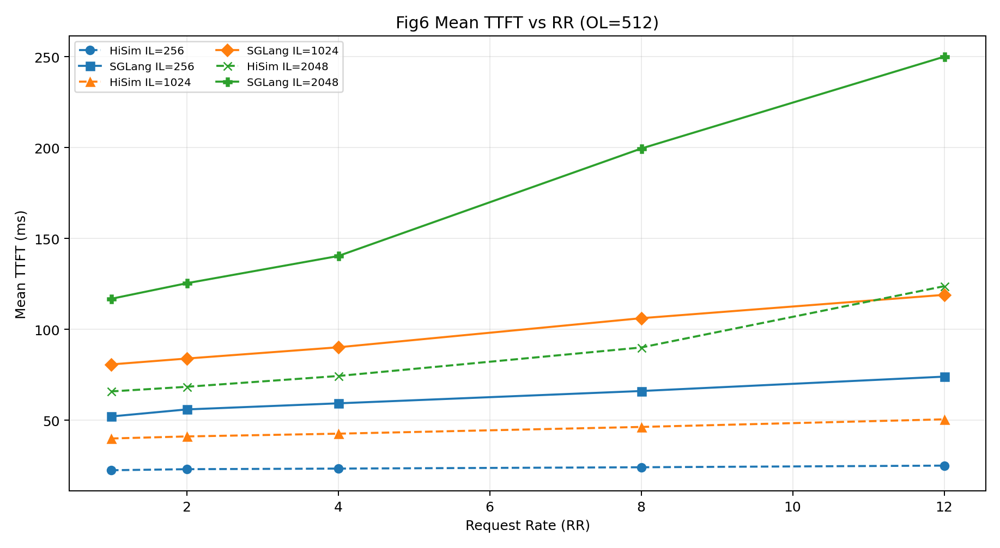
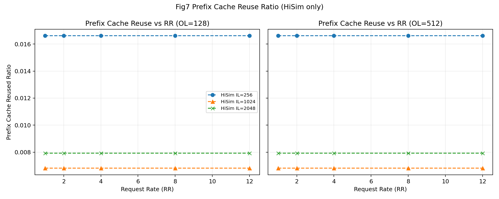

# HiSim vs SGLang 对比报告（Flush-Cache 版本）

## 1. 数据来源与对比范围
- **HiSim（本轮新数据）**：`/mnt/nfs02/users/tjiang/Gitrepo/sglang/Hisim_Data_using_flush_cache/cases_same_seed_flush_cache`
- **SGLang（实测，已加 flush-cache）**：`/mnt/nfs02/users/tjiang/Gitrepo/sglang/SGLang_Data_20260610_flush_cache`
- **Case 空间一致**：`rr={1,2,4,8,12} × il={256,1024,2048} × ol={128,512}`，共 30 组
- **每组 completed**：HiSim=200，SGLang=200

## 2. 核心结论
- 两边趋势方向一致：`RR` 增大时吞吐上升；`OL=512` 时整体延迟更高。
- 本轮新 HiSim（同 seed + flush-cache）下，**SGLang 吞吐整体更高**。
- 相比 HiSim，SGLang 在本轮数据里表现为：
  - **TTFT 更高**（明显偏高）
  - **TPOT 更低**（明显偏低）
  - **E2E 多数场景更低**（尤其高 IL 场景）

## 3. 图表对比（同图叠加）

图例规则：
- 虚线：HiSim
- 实线：SGLang
- 同色：同一参数组

### 图 1：Req Throughput vs RR（OL=128）

### 图 2：Req Throughput vs RR（OL=512）

### 图 3：Mean E2E vs RR（IL=1024）

### 图 4：Mean TPOT vs RR（IL=2048）

### 图 5：Mean TTFT vs RR（OL=128）

### 图 6：Mean TTFT vs RR（OL=512）

### 图 7：Prefix Cache Reuse Ratio vs RR（HiSim）

> 说明：SGLang bench 输出中无 `prefix_cache_reused_ratio` 字段，图 7 仅展示 HiSim。

## 4. RR=12 截面关键对比
| OL | IL | Req/s HiSim | Req/s SGLang | TTFT HiSim(ms) | TTFT SGLang(ms) | TPOT HiSim(ms) | TPOT SGLang(ms) | E2E HiSim(ms) | E2E SGLang(ms) |
| ---: | ---: | ---: | ---: | ---: | ---: | ---: | ---: | ---: | ---: |
| 128 | 256 | 10.6588 | 11.2124 | 24.40 | 58.76 | 15.01 | 12.51 | 953.80 | 874.89 |
| 128 | 1024 | 10.5677 | 11.1704 | 48.58 | 103.77 | 20.12 | 12.96 | 1280.00 | 951.60 |
| 128 | 2048 | 10.3879 | 11.1354 | 120.59 | 223.25 | 41.52 | 13.87 | 2505.18 | 1124.43 |
| 512 | 256 | 8.4645 | 8.8510 | 24.96 | 73.94 | 17.09 | 16.12 | 4222.99 | 4297.98 |
| 512 | 1024 | 8.1325 | 8.5887 | 50.43 | 118.97 | 26.05 | 18.09 | 6349.39 | 4868.71 |
| 512 | 2048 | 7.0817 | 8.1505 | 123.73 | 250.07 | 48.95 | 21.25 | 11044.08 | 5819.43 |

### RR=12 百分比差异（SGLang - HiSim）
| OL | IL | Req Δ% | TTFT Δ% | TPOT Δ% | E2E Δ% |
| ---: | ---: | ---: | ---: | ---: | ---: |
| 128 | 256 | +5.2% | +140.8% | -16.7% | -8.3% |
| 128 | 1024 | +5.7% | +113.6% | -35.6% | -25.7% |
| 128 | 2048 | +7.2% | +85.1% | -66.6% | -55.1% |
| 512 | 256 | +4.6% | +196.3% | -5.6% | +1.8% |
| 512 | 1024 | +5.6% | +135.9% | -30.5% | -23.3% |
| 512 | 2048 | +15.1% | +102.1% | -56.6% | -47.3% |

## 5. 补充观察（Flush-Cache 有效性）
- HiSim 的 `prefix_cache_reused_ratio` 在本轮显著降低：`min=0.0068, max=0.0166, mean=0.0104`，说明 flush-cache 生效、缓存复用干扰显著降低。
- 但 HiSim 的 `mean_kv_transfer_ms` 和 `mean_decode_queue_ms` 仍为 0（30/30），这部分阶段时延在当前配置下仍未被拉起。

## 6. 产物文件
- 对比汇总表：`/mnt/nfs02/users/tjiang/Gitrepo/sglang/flush_cache_compare_20260611/summary_compare.csv`
- 对比图目录：`/mnt/nfs02/users/tjiang/Gitrepo/sglang/flush_cache_compare_20260611/plots/`
